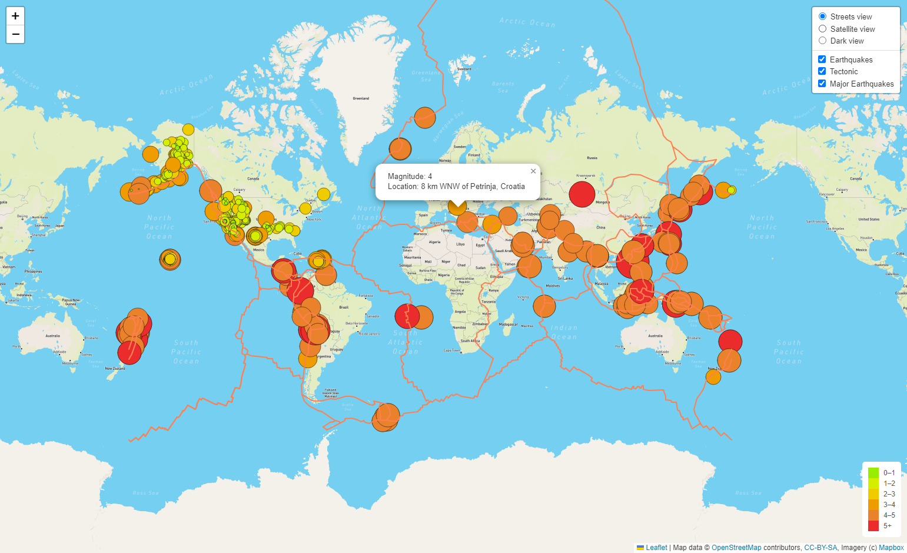
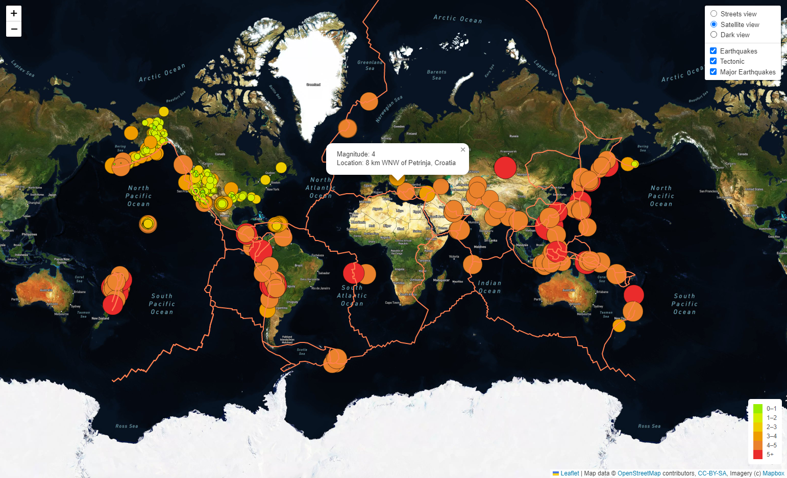
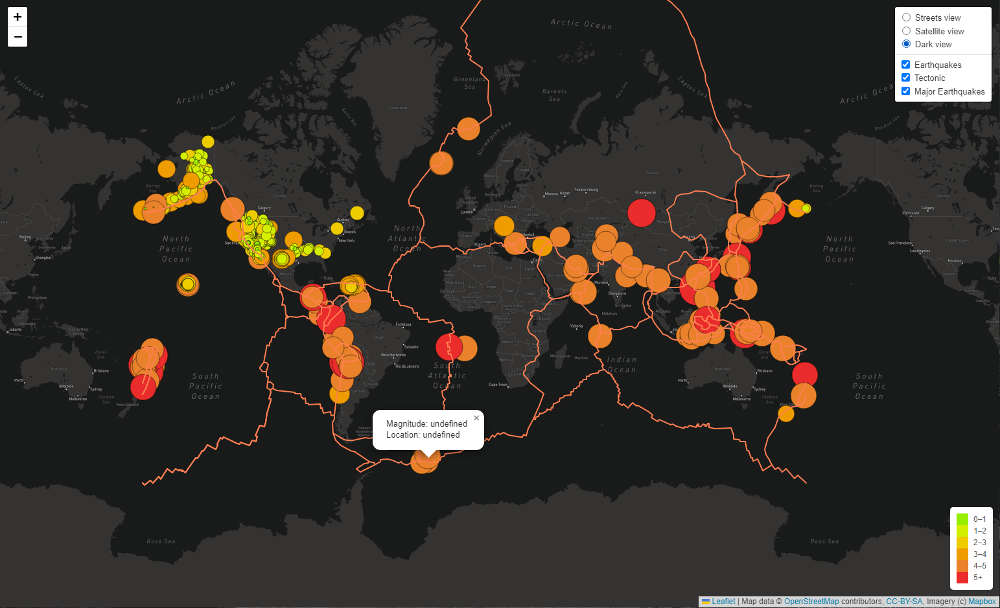
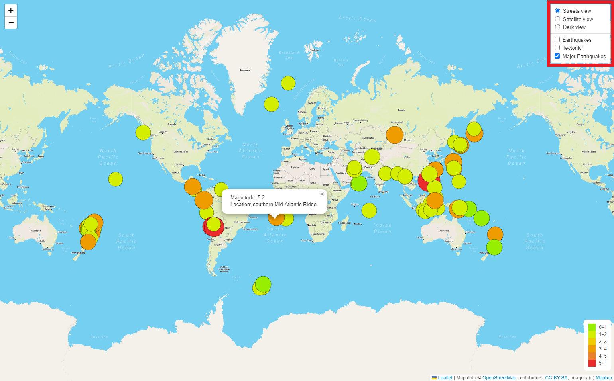

# Mapping_Earthquakes
A project to visualize the earthquake GeoJSON data from USGS with interactive maps using JavaScript, Leaflet.js, and geoJSON.
The earthquake data is represented on the maps in relation to the tectonic plates’ location on the earth, and according to each event's magnitude.

### Resources

- Data Source :  [Eartquake GeoJSON](https://earthquake.usgs.gov/earthquakes/feed/v1.0/summary/all_week.geojson),  [Earthquake above 4.5 GeoJSON](https://earthquake.usgs.gov/earthquakes/feed/v1.0/summary/4.5_week.geojson),  [Tectonic Plate GeoJSON](https://raw.githubusercontent.com/fraxen/tectonicplates/master/GeoJSON/PB2002_boundaries.json)
- Softwares :  HTML,  CSS,  [JavaScript](https://www.w3schools.com/js/default.asp),  [D3.js](https://d3js.org/),  [Leaflet](https://leafletjs.com/examples/geojson/)

## Analysis
To interact with the maps API the user needs to visit [mapbox.com](https://www.mapbox.com/), create an account and retrieve the access token.
 

 

Thec, call the token file in the html file.
 

 

To run the index.html file, open the Terminal in VS-Code, navigate to your project folder and enter  _**python -m http.server**_  command.  

## Link to interactive map
The deployed webpage is accessible at &nbsp;  https://mousavilaleh.github.io/EarthquakeMap/   

### Map View

with the center of [40.7, -94.5] cordinates.   

Street View 

 

Satellite View

 

Dark View 

 

User also can choose which data to display.  

 

 
